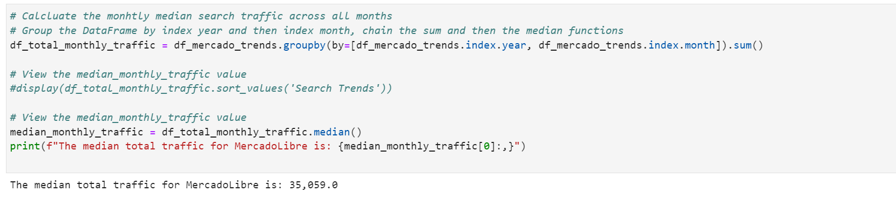
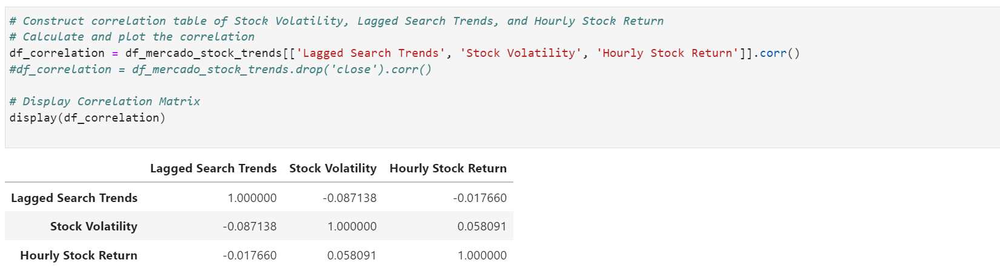
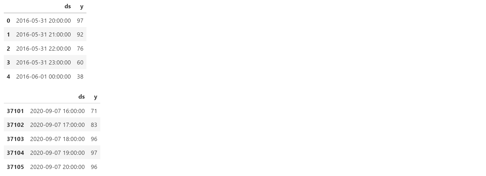

# Module 11 Challenge: Forecasting Net Prophet

## Background

In this scenario, you’re a growth analyst at [Mercado Libre](http://investor.mercadolibre.com/investor-relations). With over 200 million users, Mercado Libre is the most popular e-commerce site in Latin America. You've been tasked with analysing the company's financial and user data in clever ways to help the company grow.

In a bid to drive revenue, you’ll produce a Jupyter notebook that contains your data preparation, your analysis, and your visualisations for all the time series data that the company needs to understand. You’ll use text and comments to document your findings. And, you’ll answer the question prompts in the instructions. Specifically, this notebook should contain the following:

* Visual depictions of seasonality (as measured by Google Search traffic) that are of interest to the company.

* An evaluation of how the company stock price correlates to its Google Search traffic.

* A Prophet forecast model that can predict hourly user search traffic.

* Answers to the questions in the instructions that you write in your Jupyter notebook.

* (Optional) A plot of a forecast for the company’s future revenue.

When you finish, you’ll push your final notebook to your GitHub repository so that others can review your work.

You’ll gain proficiency in the following tasks:

* Identifying patterns in time series data.

* Mining for patterns in seasonality by using visualisations.

* Building sales-forecast and user-interest predictive models.

---

## Files

Download the following files to help you get started:

[Forecasting Net Prophet notebook](Instructions/Starter_Code/forecasting_net_prophet.ipynb)

[Data files](Instructions/Starter_code/Resources)

---

## Instructions

First, configure a Google Colaboratory, or Colab, workspace as follows:

1. Open [Google Colab](https://colab.research.google.com/), and then upload your starter notebook.

2. Run the provided code in the “Install and import the required libraries and dependencies” section. Note the following:

   * The first cell installs the necessary libraries into the Google Colab runtime.

   * The second cell imports the dependencies for use in the notebook.

With your workspace configured, you can begin the assignment. The instructions are divided into four steps and an optional fifth step as follows:

* Step 1: Find unusual patterns in hourly Google search traffic.

* Step 2: Mine the search traffic data for seasonality.

* Step 3: Relate the search traffic to stock price patterns.

* Step 4: Create a time series model by using Prophet.

* Step 5 (optional): Forecast the revenue by using time series models.

The following subsections detail these steps.

---    

## Solution  
[Jupyter Notebook](code/forecasting_net_prophet.ipynb)
  
---    
### Step 1: Find Unusual Patterns in Hourly Google Search Traffic

The data science manager at Mercado Libre asks you if the Google search traffic for the company links to any financial events at the company. Or, does the search traffic data just present random noise? To answer this question, you’ll pick out any unusual patterns in the Google search data for the company, and connect them to the corporate financial events.

Answering the question requires you to complete the following steps:

1. Read the search data into a DataFrame, and then slice the data to just the month of May 2020. (During this month, Mercado Libre released its quarterly financial results.) Use hvPlot to visualise the results. Do any unusual patterns exist?
   - Load Data into Dataframe
   - Visualize with Holoviews
   - Visualization
  
**ANSWER: Yes, there appears to be a daily patter raging from 10 to 100**  
  
2. Calculate the total search traffic for the month, and then compare the value to the monthly median across all months. Did the Google search traffic increase during the month that Mercado Libre released its financial results?
   - Total May Traffic
   - Meadian Monthly Views: Approach 1
   - Meadian Monthly Views: Approach 2
   - Comparison of May to the Median
  
**ANSWER: Yes, trafic is higher in May 2020 versus most months, the month that MercadoLibre released its financial results.**  
  
---  
### Step 2: Mine the Search Traffic Data for Seasonality

The Marketing department realises that they can use the hourly search data, too. If they can track and predict interest in the company and its platform for any time of day, they can focus their marketing efforts around the times that have the most traffic. This will get a greater return on investment (ROI) from their marketing budget.

To help Marketing, you'll want to mine the search traffic data for predictable seasonal patterns of interest in the company. Complete the following steps:

1. Group the hourly search data to plot the average traffic by the day of the week (for example, Monday vs. Friday).
   - Calculate Day of Week Mean  
   - Visualize Day of Week Mean  
  
  
2. Using hvPlot, visualise this traffic as a heatmap, referencing `index.hour` for the x-axis and `index.dayofweek` for the y-axis. Does any day-of-week effect that you observe concentrate in just a few hours of that day?  
   - Create Dataframe: Day of Week vs. Hour of Day  
   - Visualize Day of Week vs. Hour of Day  
  
**ANSWER: Most seraches apear to happen in prime time (19:00 - 20:00) and on the weekends (0-Sun, 6-Sat), the volume is lower on 5-Thu and 6-Fri.**  
  
3. Group the search data by the week of the year. Does the search traffic tend to increase during the winter holiday period (weeks 40 through 52)?
   - Calculate Day of Week Mean
   - Visualize Day of Week Mean
  
**ANSWER: Yes, the traffic increases in the last weeks of the year.**  
  
---  
### Step 3: Relate the Search Traffic to Stock Price Patterns

During a meeting with people in the Finance group, you mention your work on the search traffic data. They want to know if any relationship between the search data and the company stock price exists, and they ask if you can investigate.

You can find out the answer by completing the following steps:

1. Read in and plot the stock price data. Concatenate the stock price data to the search data in a single DataFrame.
   - Read Stock Price Dataframe  
   - Deterine Daily Close  
   - Visualize Daily Close  
   - Create Daily Traffic Dataframe  
   - Concatinate Daily Close with Daily Traffic Dataframes  
   - Daily Close and Daily Traffic Dataframe  
        
  
2. Note that market events emerged during 2020 that many companies found difficult. But after the initial shock to global financial markets, new customers and revenue increased for e-commerce platforms. So, slice the data to just the first half of 2020 (`2020-01` to `2020-06` in the DataFrame), and then use hvPlot to plot the data. Do both time series indicate a common trend that’s consistent with this narrative?
   - Calculate Day of Week Mean
   - Visualize Day of Week Mean
   - Visualize Day of Week Mean

      **NOTE: The dip is due to missing data 02-25-2020 to 03-09-2020.**  
            - Missing from Google search data.  
            - Exists in stock prices data.   

**ANSWER: No. this analysis does not support that narative.**   
   - It is possible that the stock price increase is indicative of increased revenue.
   - Daily search trafic remains constant indicating no net new customers.    
     
3. Create a new columns in the DataFrame named: 

   * “Lagged Search Trends” that offsets, or shifts, the search traffic by one hour.
   
   * “Stock Volatility”, which holds an exponentially weighted four-hour rolling average of the company’s stock volatility.
   - Visualize Stock Volatility.  
   * “Hourly Stock Return”, which holds the percentage of change in the company stock price on an hourly basis.
   - New Dataframe. 
  
  
4. Review the time series correlation, and then answer the following question: Does a predictable relationship exist between the lagged search traffic and the stock volatility or between the lagged search traffic and the stock price returns?
   - Calculate Correlations
   - Visualize Correlations
  
**ANSWER: No, predictable relationships do not exist.**  
    
---  
### Step 4: Create a Time Series Model by Using Prophet

Now, you need to produce a time series model that analyses and forecasts patterns in the hourly search data. Complete the following steps to create the model:

1. Set up the Google search data for a Prophet forecasting model.
   - Create Prophet Dataframe
   - Prophet Dataframe
   - Create Prophet Model
   - Fit Prophet Model
   - Create Forecast Dataframe
   - Predict Prophet Model
   - Prophet Model Predictions
  
2. After estimating the model, plot the forecast. What is the near-term forecast for the popularity of Mercado Libre?
   - Forecast Plot
  
**ANSWER: Trending downwards.**  
  
3. Plot the individual time series components of the model to answer the following questions:
   
   * What time of day exhibits the greatest popularity?
   - Time of Day Trend
  
**ANSWER: Prime Time - Apout 20:00.**  
   
   - Which day of the week gets the most search traffic?  
   - Day of Week Trend  
  
**ANSWER: Tuesday.**  
  
   - What's the lowest point for search traffic in the calendar year?  
   -  Day of Year Trend  
   
**ANSWER: October.**    
  
 --- 
### Step 5 (Optional): Forecast the Revenue by Using Time Series Models

A few weeks after your initial analysis, the finance group follows up to find out if you can help them solve a different problem. Your fame as a growth analyst in the company continues to grow!

Specifically, the finance group wants a forecast of the total sales for the next quarter. This will dramatically increase their ability to both plan budgets and help guide expectations for the company investors.

To create the forecast, complete the following steps:

1. Read in the daily historical sales (that is, revenue) figures, and then apply a Prophet model to the data.
   - Read Daily Sales
   - Visualize Daily Sales
   - Configure Daily Sales Data for Prophet Model
   - Create and Fit Prophet Model
   - Create Prediction Dataframe (to Sep. 30, 2020)
   - Make Predictions
   - Prophet Model Predictions
    
2. Interpret the model output to identify any seasonal patterns in the company revenue. For example, what are the peak revenue days? (Mondays? Fridays? Something else?)
   - Model Paterns
   
 
**ANSWER: Highest dates are Monday to the peak on Wednesday. Lowest is Saturday.**  
   
  
3. Produce a sales forecast for the finance group. Give them a number for the expected total sales in the next quarter. Include the best- and worst-case scenarios to help them make better plans.
   - Model Paterns
   - Sales Forecast Daily for Q3
   - Sales Forecast for Q3
  
**ANSWER: Most Likely = \$2,163, Worst Case = \$1,988, Best Case = \$2,338.**  
    
---

## Submission

* Create Jupyter notebooks for the analysis, and host them on GitHub.

* Include a Markdown file that summarises your models and findings, and include this report in your GitHub repo.

* Submit the link to your GitHub project to Bootcamp Spot.

---

© 2022 Trilogy Education Services, a 2U, Inc. brand. All Rights Reserved.
